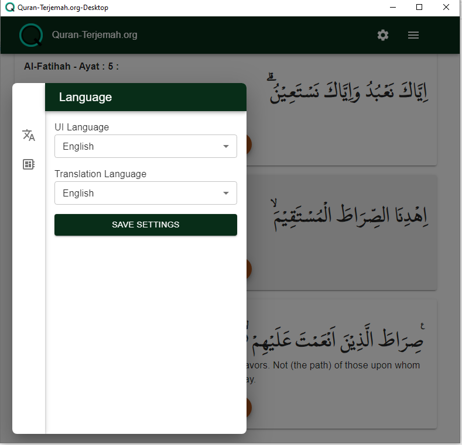

# Quran-Translation.org

## About

Quran Translation is a desktop version application, from the website [Quran-terjemah.org](https://quran-terjemah.org) for reading the Quran and listening to Quran reciters like Mishary bin Rashid Alafasy and others.

This application uses the Indonesian Ministry of Religious Affairs database and is developed with Wails.

The audio source in this application comes from other websites, among them is [www.everyayah.com](https://www.everyayah.com)


## Language
For users who speak Indonesian, you can read the information through: 
[Readme Indonesia](./README_id.md)
 

## Install

For Windows users, you can directly download it on the [release page](https://github.com/nnttoo/quran-terjemah_org/releases/latest),
whereas for other OS users, you can build from the source by   

```
wails build 
```
 
For complete information about wails, you can see it here [wails](https://wails.io/)

## Screenshot

 