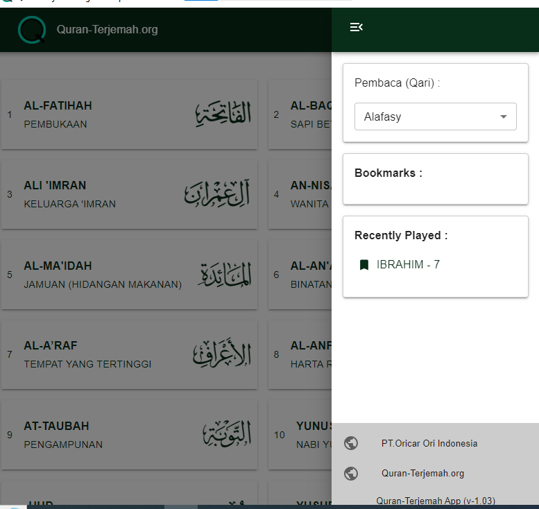
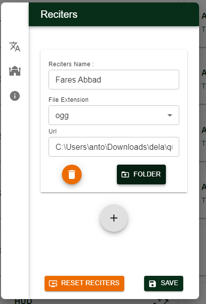

# Quran-Translation.org


For users who speak Indonesian, you can read the information through: 
[Readme Indonesia](./README_id.md)

## About

Quran Translation is a desktop version application, from the website [Quran-terjemah.org](https://quran-terjemah.org) for reading the Quran and listening to Quran reciters like Mishary bin Rashid Alafasy and others.

This application uses the Indonesian Ministry of Religious Affairs database and is developed with Wails.

The audio source in this application comes from other websites, among them is [www.everyayah.com](https://www.everyayah.com)

 

## Install

[](https://github.com/nnttoo/quran-terjemah_org/releases/latest)

For Windows users, you can directly download it on the [release page](https://github.com/nnttoo/quran-terjemah_org/releases/latest),
whereas for other OS users, you can build from the source by   

```
wails build 
```
 
For complete information about wails, you can see it here [wails](https://wails.io/)

## Screenshot

 
 
 
## Offline Reciters Playback

You can play the Reciters offline by inserting the folder where you store the audio files. The audio files for the Quran can be obtained from several sources, including the Quran project version here: [sourceforge](https://sourceforge.net/projects/quranterjemah/files/Audio/quran-terjemah-audio.zip/download)

- Download the Audio File
- Extract the audio file from the zip file
- Open the settings in the quran-terjemah.org app
    
    

- Then type the name, and select the file type, if you download from the link I showed then select ogg
- Press save 