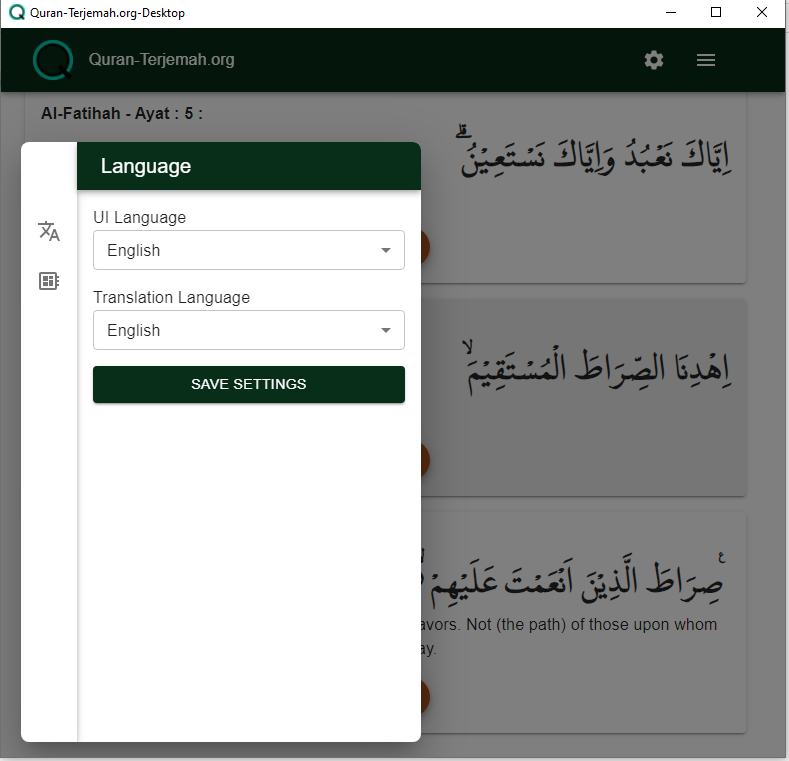

# Quran-Terjemah.org

## About

Quran Terjemah adalah aplikasi versi desktop, dari website [Quran-terjemah.org](https://quran-terjemah.org) untuk membaca alquran dan mendengarkan pelantun alquran seperti Mishary bin Rashid Alafasy dan yang lainnya.

Aplikasi ini menggunakan database kemenag indonesia dan dikembangkan dengan Wails,

Sumber audio di dalam aplikasi ini berasal dari website lain, diantaranya dalah [www.everyayah.com](www.everyayah.com)


## Bahasa
Untuk pengguna yang berbahasa indonesia dapat membaca informasi melalui : 
[Readme Indonesia](./README_id.md)
 

## Install

Untuk pengguna windows, anda bisa langsung mengunduh di [halaman release](https://github.com/nnttoo/quran-terjemah_org/releases/latest),
sedangkan untuk pengguna Os lain, anda bisa build dari source dengan cara   

```
wails build 
```
 
Untuk informasi lengkap mengenai wails bisa anda lihat di sini [wails](https://wails.io/)

## Screenshot

